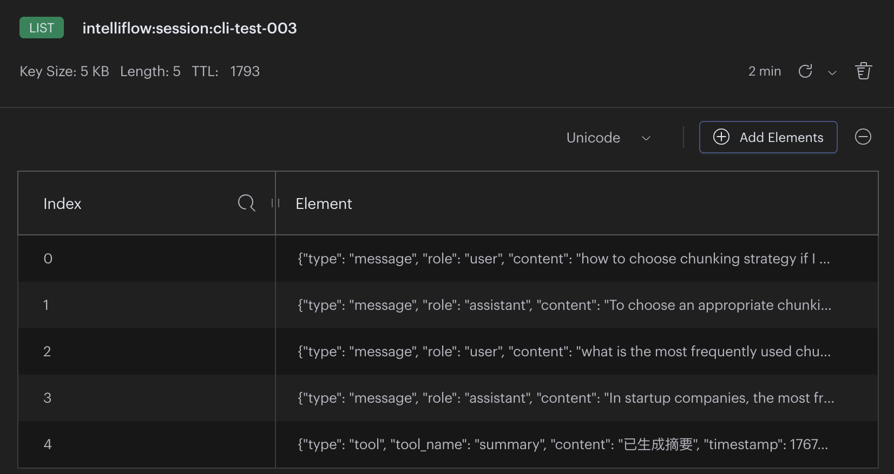
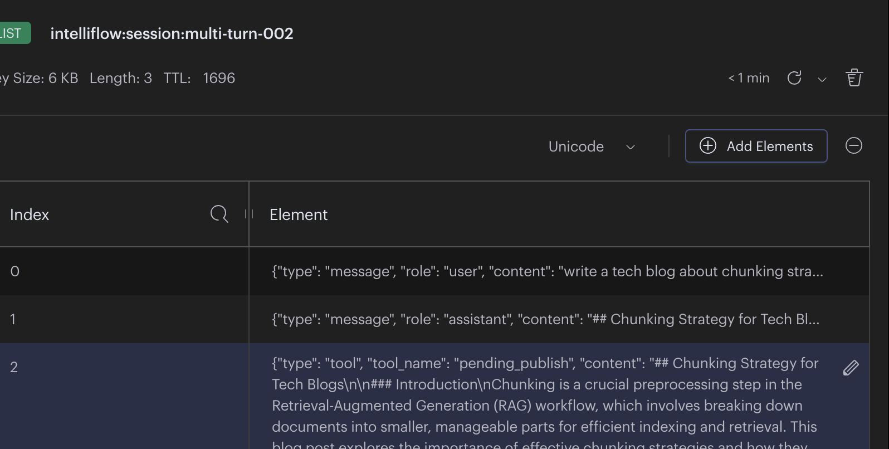
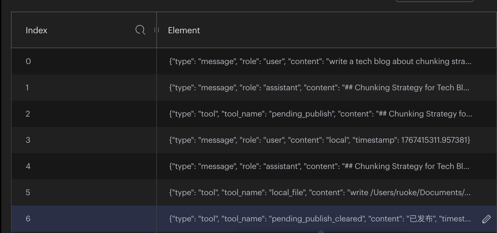

# IntelliFlow Demo (FastAPI + RAG + Agents + MCP)

最小可运行示例，涵盖：FastAPI、pgvector RAG、会话记忆、代理编排、SSE、MCP 工具（GitHub 发布 + 本地文件写入）、APScheduler 定时任务。


## 架构要点
- RAG：Tika 解析 → 结构感知/Token 分块 → OpenAI 向量 → pgvector 粗排 → Cohere Rerank 精排。  
- Memory：短期窗口（内存/Redis），超长后 LLM 自动摘要入库并向量化。  
- 代理：聚合上下文 + 记忆 → LLM 规划 → MCP 工具（GitHub、本地文件）→ SSE 事件。  
- 调度：APScheduler 定时运行示例任务。

## Rerank 配置
本系统集成了一套标准的两阶段检索流程：
1. **粗排**：pgvector 快速检索出 Top-N 个候选块。
2. **精排**：调用 Cohere Rerank 模型对候选块进行深度对比重新打分。

在 `.env` 中配置 `COHERE_API_KEY` 即可开启精排功能。若未配置，系统将自动降级为纯向量检索。


```shell
curl -X POST http://localhost:8000/ingest/url \
  -H "Content-Type: application/json" \
  -d '{
    "url": "https://learn.microsoft.com/zh-cn/azure/architecture/ai-ml/guide/rag/rag-chunking-phase",
    "source": "microsoft_blog",
    "chunk_size": 800,
    "chunk_overlap": 100
  }'
```
```shell
# 查看最近导入的 5 个分块及其所属文档来源
psql intelliflow -c "
SELECT 
    d.source, 
    c.chunk_index, 
    LEFT(c.content, 100) as content_preview, 
    c.created_at 
FROM document_chunks c 
JOIN documents d ON c.document_id = d.id 
ORDER BY c.created_at DESC 
LIMIT 5;"
```

```shell
curl -X POST "http://localhost:8000/ingest/upload" \
     -H "accept: application/json" \
     -H "Content-Type: multipart/form-data" \
     -F "file=@assets/watermark.pdf"
```
```
curl -X POST http://localhost:8000/rag/query \
  -H "Content-Type: application/json" \
  -d '{
    "query": "你好你给我讲一下LLM watermark",
    "top_k": 3
  }'
```
## 构建上下文
1. 用户query改写，改写为更适合RAG检索的短句
2. 检索获得相关的chunk
3. 在memory_summaries表中，对用户query执行向量相似度检索，获取相关的聊天summry

## Session
- 基于时间拆分。聊天记录被实时添加到Redis中，并且一个session只保留固定数量条聊天记录，添加和删除聊天记录用Lua脚本实现
  

- session中的消息达到一定阈值之后，持久化到数据库

  

## MCP
### save as a local file
Example: Explicitly specify publishing to a local file
```shell
curl -X POST http://localhost:8000/agents/run -H "Content-Type: application/json" -d '{"session_id":"test-intent-002","prompt":"write a tech blog about chunking strategy and save as local markdown file, using a suitable filename"}'
```


### let it generate a file, not specifing where to save

```shell
curl -X POST http://localhost:8000/agents/run \
  -H "Content-Type: application/json" \
  -d '{
    "session_id": "multi-turn-002",
    "prompt": "local"
  }'
```
Agent will ask you if you want to save it as a local file or publish it to GitHub

File content will be stored in Redis temporarily.


Answer agent's question

```shell
curl -X POST http://localhost:8000/agents/run \
  -H "Content-Type: application/json" \
  -d '{
    "session_id": "multi-turn-002",
    "prompt": "local"
  }'
```
you can now see the pending state is cleared, and a local file is generated
